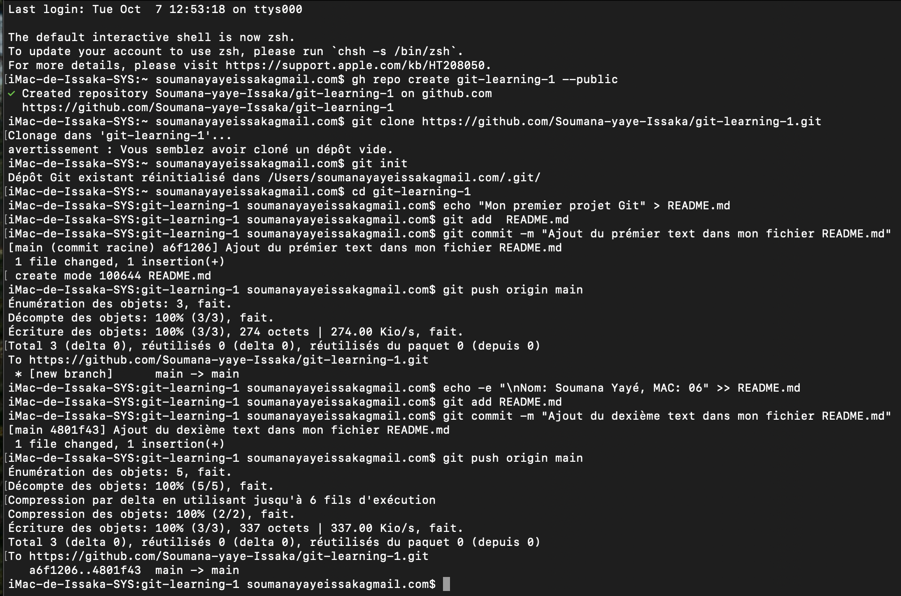

# git-learning-1

Ce projet a pour but d'apprendre les bases de Git et GitHub en ligne de commande.

## Étape 1 : Créer un nouveau dépôt GitHub

> ' gh repo create git-learning-1' : Crée un dépôt nommé **git-learning-1**.

---

## Étape 2 : Cloner le dépôt localement

```bash
git clone https://github.com/votre-utilisateur/git-learning-1.git
cd git-learning-1
```
- `git clone ...` : copie le dépôt distant sur ta machine.
- `cd git-learning-1` : entre dans le dossier du projet.

---

## Étape 3 : Créer un fichier README.md

```bash
echo "Mon premier projet Git" > README.md
```
- Crée un fichier `README.md` avec le texte "Mon premier projet Git".

---

## Étape 4 : Ajouter une ligne avec ton nom et ton numéro de MAC

```bash
echo "Nom: Jean Dupont, MAC: 12345" >> README.md
```
- Ajoute une ligne à la fin du fichier `README.md` avec ton nom et ton numéro de MAC.

---

## Étape 5 : Ajouter, commit et push

```bash
git add README.md
git commit -m "Ajout du fichier README avec mon nom et MAC"
git push origin main
```
- `git add README.md` : prépare le fichier pour le commit.
- `git commit -m ...` : enregistre les modifications localement avec un message.
- `git push origin main` : envoie les modifications sur GitHub (branche `main`).

> Si ta branche s'appelle `master` :
> ```bash
> git push origin master
> ```
---
## Étape 6 : un capture de mon de travail : 
 