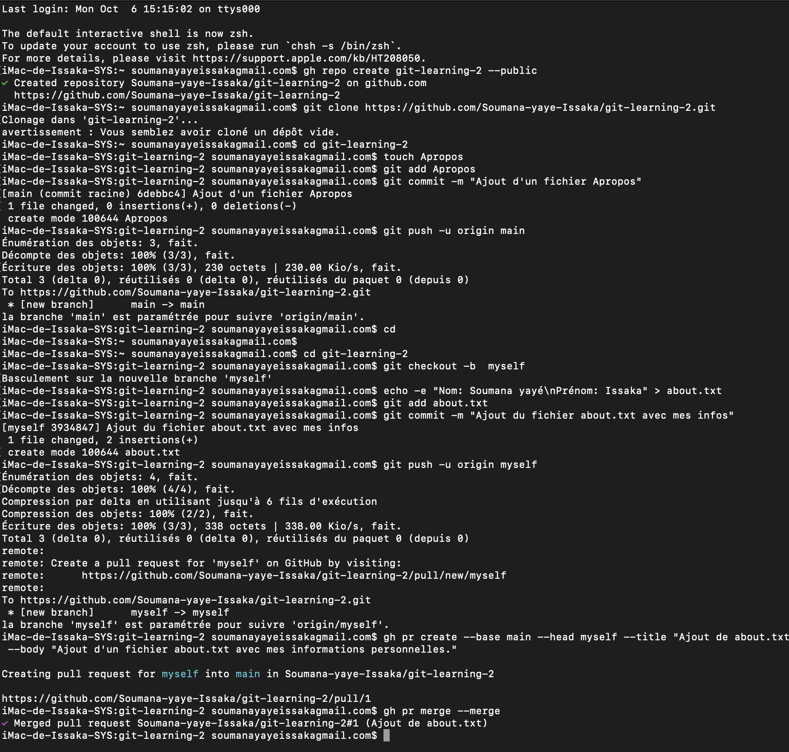

# git-learning-2

Ce projet montre comment utiliser Git et GitHub CLI pour gérer un flux de travail avec branches et Pull Requests.

## 1. Créer un nouveau dépôt GitHub

```bash
gh repo create git-learning-2 --public --clone
cd git-learning-2
```
- `gh repo create ...` : crée un nouveau dépôt public nommé **git-learning-2** sur GitHub et le clone localement.
- `cd git-learning-2` : entre dans le dossier du projet.

---

## 2. Créer une branche `myself`

```bash
git checkout -b myself
```
- Crée et bascule sur une nouvelle branche appelée `myself`.

---

## 3. Créer un fichier `about.txt` avec vos informations

```bash
echo "Nom : Jean Dupont" > about.txt
echo "Prénom : Jean" >> about.txt
echo "Lieu de naissance : Paris" >> about.txt
```
- Crée un fichier `about.txt` et y ajoute vos informations personnelles.

---

## 4. Commit et push de la branche

```bash
git add about.txt
git commit -m "Ajout du fichier about.txt avec mes infos personnelles"
git push origin myself
```
- `git add about.txt` : prépare le fichier pour le commit.
- `git commit -m ...` : enregistre les modifications localement avec un message.
- `git push origin myself` : envoie la branche `myself` sur GitHub.

---

## 5. Créer une Pull Request de `myself` vers `main`

```bash
gh pr create --base main --head myself --title "Ajout de about.txt" --body "Ce PR ajoute mes informations personnelles."
```
- Crée une Pull Request pour fusionner la branche `myself` dans `main`.

---

## 6. Merger la Pull Request

```bash
gh pr merge --merge
```
- Fusionne la Pull Request avec un merge classique (`--merge`).

## 7.Voici un capture de mon travail:
