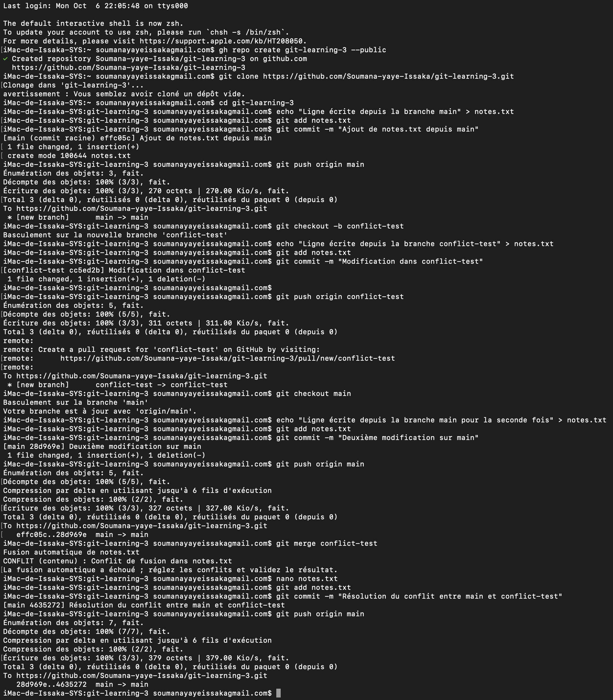

# git-learning-3

Ce README explique comment générer un conflit Git, puis le résoudre manuellement étape par étape.

--------------------
## 1. Créer le dépôt et le cloner avec GitHub CLI

```bash
gh repo create git-learning-3 --public --clone
cd git-learning-3
```
- Crée un dépôt public nommé **git-learning-3** sur GitHub et le clone localement.
---------------------
## 2. Sur la branche `main`, créer `notes.txt`

```bash
echo "Ligne écrite depuis la branche main" > notes.txt
git add notes.txt
git commit -m "Ajout initial dans notes.txt depuis main"
git push origin main
```
- Crée le fichier `notes.txt` et ajoute une première ligne depuis la branche `main`.
-----------------------
## 3. Créer la branche `conflict-test` et modifier le fichier

```bash
git checkout -b conflict-test
echo "Ligne écrite depuis la branche conflict-test" > notes.txt
git add notes.txt
git commit -m "Modification dans notes.txt depuis conflict-test"
git push origin conflict-test
```
- Crée une nouvelle branche, modifie `notes.txt` et pousse la branche.
-----------------------
## 4. Revenir sur `main` et modifier `notes.txt` différemment

```bash
git checkout main
echo "Ligne écrite depuis la branche main pour la seconde fois" > notes.txt
git add notes.txt
git commit -m "Deuxième modification dans notes.txt depuis main"
git push origin main
```
- Modifie à nouveau `notes.txt` sur `main` pour générer un futur conflit.
-----------------------
## 5. Essayer de merger `conflict-test` dans `main`

```bash
git merge conflict-test
```
- Tente de fusionner la branche `conflict-test` dans `main`.  
- 💥 Un conflit de fusion apparaît dans `notes.txt`.
------------------------
## 6. Résoudre le conflit dans `notes.txt`

- Ouvre `notes.txt` dans un éditeur (`nano`, `vim`, ou VS Code).
- Remplace le contenu conflictuel par :

```
Ligne écrite depuis la branche main pour la seconde fois
Ligne écrite depuis la branche conflict-test
```
--------------------------
## 7. Finaliser le merge

```bash
git add notes.txt
git commit -m "Résolution du conflit entre main et conflict-test"
git push origin main
```
## 8. Un capture de mon travil:  
